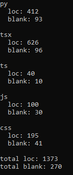

# Lines of Code

### Summary

A simple script to count the lines of code in a given directory.

### Configs

- `root` the root directory that you want searched.
- `exts` the file type extensions you wish to parse.
- `exclude_dirs` the directories you want to skip.
- `output_checked_files` whether or not to print the parsed filepaths.

### Preview

